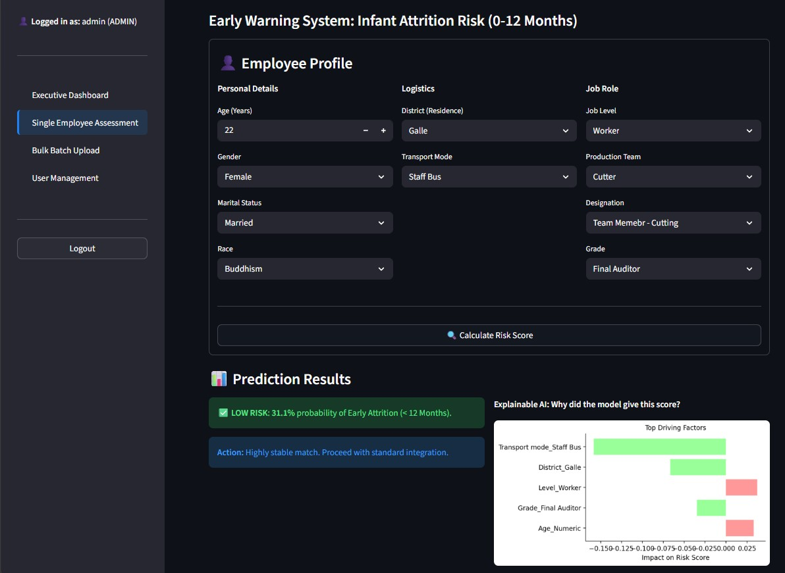
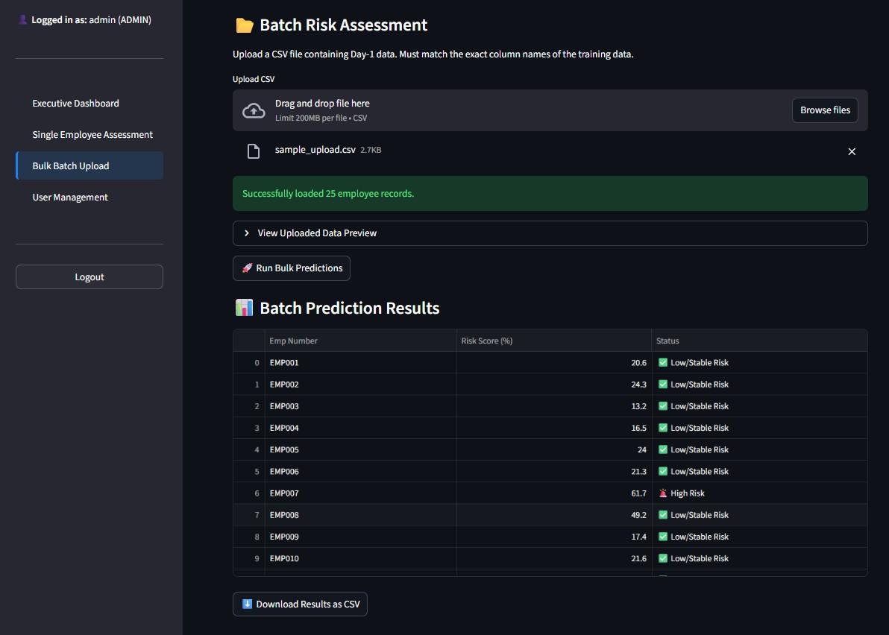
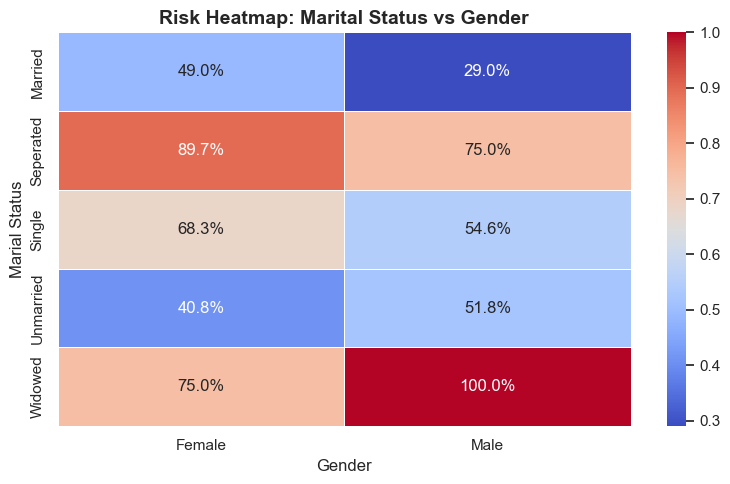
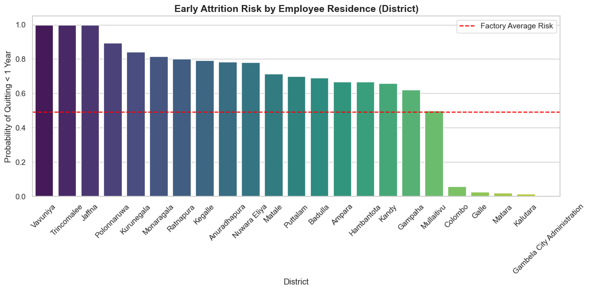
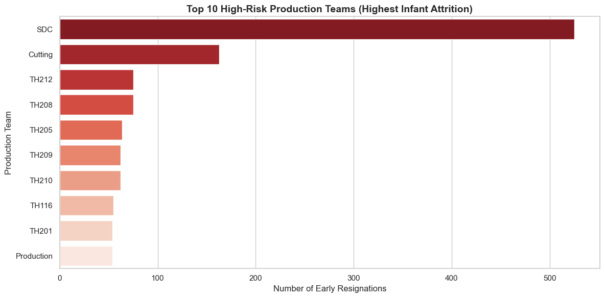

# Predictive HR Analytics: Early Warning System for Infant Attrition 🚀

## Overview
The Predictive HR Analytics platform is a secure, data-driven Early Warning System built to combat "Infant Attrition" (0-12 month employee turnover) in the garment sector. Rather than reacting to resignations after they occur, this system utilizes Machine Learning to proactively flag high-risk employees during their onboarding phase.

Built with an interpretable **Random Forest** architecture and **Explainable AI (SHAP)**, the system not only predicts flight risk but clearly visualizes *why* an employee is at risk, empowering HR managers to take immediate, targeted action.

---

## Key Features 🌟
- **Single Employee Assessment:** Manually input new hire details and instantly receive a predicted Attrition Risk Score (0-100%).
- **Explainable AI (SHAP):** Transparent, dynamic visualization showing the Top 5 driving factors (positive and negative) behind an employee's specific risk score.
- **Bulk Batch Processing:** Upload hundreds of employee records via CSV for instantaneous factory-wide risk assessment. Features strict schema validation to prevent system crashes.
- **Executive Dashboard:** Real-time data visualization tracking factory risk trends, team-level vulnerabilities, and geographical attrition hotspots.
- **Role-Based Access Control (RBAC):** Secure SHA-256 password hashing separating standard HR users from System Administrators.

---

## Screenshots 📸

### Single Employee Assessment & Explainable AI


### Bulk Processing Validation


### Demographic Risk Heatmap (Marital Status vs. Gender)


### Geographical Risk Hotspots


### Departmental Vulnerability


---

## System Architecture 🏗️
1. **Frontend:** Streamlit (Python) - Dynamic, accessible UI for HR personnel.
2. **Backend Logic:** Scikit-Learn - Random Forest Classifier (Tuned via 5-Fold Cross-Validation).
3. **Database:** MySQL - Securing user credentials, roles, and batch metrics.

## Model Performance Metrics 📊
The Random Forest model was specifically hyperparameter-tuned (`n_estimators=500`, `max_depth=10`) using `RandomizedSearchCV` to maximize **Recall** over generic Accuracy, ensuring the system catches true flight risks.
- **Recall (Sensitivity):** 98.62% 
- **Precision:** 73.57%
- **Accuracy:** 81.59%
- **F1-Score:** 84.27%

---

## Installation & Usage 💻

### Prerequisites
- Python 3.10+
- MySQL Server

### 1. Database Setup
Create a MySQL database named `hela_hr_db`.
```sql
CREATE DATABASE hela_hr_db;
```

### 2. Install Dependencies
```bash
pip install pandas scikit-learn streamlit shap mysql-connector-python
```

### 3. Run the Application
```bash
streamlit run app/app.py
```

---
## Project Context 🎓
This system was developed as the final artifact for the **6CS007 Module**, bridging the gap between theoretical Machine Learning and practical Software Engineering.
